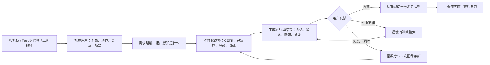

# 《这一帧怎么说》赛道立项与资源申请方案

> 大区赛评审稿 / 业务资源申请口径
>
> 定位：不是背词工具，也不是拍照翻译的换皮，而是把"这个用英语怎么说"的好奇心瞬间，变成从用户自己生活里长出来的语言资产。
>
> 两个入口：**相机是你眼前的生活，短视频是你想去的生活。**

## 0. 立项结论

**建议立项为：把世界变成课本的视觉语言搜索能力。**

它解决的断层是：用户的英语学习材料和自己的生活是系统性脱节的。背了几千个词，站在自己家里说不出十样东西的英文；课本教你谈论伦敦的天气，没人教你"花洒""共享充电宝""地铁闸机"怎么说。而"这个用英语怎么说"的好奇心每天真实发生——路上的东西、想去的地方、刷到的别人的生活。

```text
好奇心瞬间（眼前看到的 / 想去的地方）
→ 指着：拍一帧 或 暂停一帧
→ 视觉理解与语言需求判断
→ 适配水平的表达结果
→ 收藏为帧词卡（画面 + 表达）
→ 回到原画面复习
→ 下一次搜索更懂用户
```

本次大区赛已完成可体验的 Web MVP，相机、视频上传、示例画面三种视觉入口全部可用，验证最关键的"指着 → 识别 → 入库 → 复习"闭环。业务化需要的是把这套能力接进更大的内容供给（抖音 Feed）和真实生活场景，而不是再做一个独立背词 App。

## 1. 核心目标（Mission）

让用户生活里每一个"这个用英语怎么说"的瞬间，都能当场得到适合自己水平的答案，并沉淀成带着画面的记忆。

### 北极星命题

**学了多年英语的人，说不出自己的生活。我们要让你学的每一个词，都来自你亲眼看见的世界。**

### 为什么是真实需求

"这个用英语怎么说"不需要学习动机支撑——它不是"我要学英语"的决心，而是每个人都问过的一句话：出国旅行对着菜单、看剧听到一句台词、给孩子指认东西、刷到一个想去的地方。好奇心是即时的、具体的、带着画面的。现有工具全都接不住这个瞬间：

- **词典 / 搜索**：要求用户先把看见的东西描述成关键词——会描述就不会问了。
- **拍照翻译**：处理的是画面上*已有的文字*，翻完即走；而生活中绝大多数想问的东西（物品、动作、场景）身上并没有贴着文字。
- **背词 App**：词表是它的，不是用户的。脱离生活的词，背了就忘。

### 待验证的业务假设

1. 相机与暂停帧能以接近零的成本承接"这个怎么说"的好奇心瞬间（不需要打字、不需要描述）。
2. 按用户水平（CEFR）挑选"刚好多一步"的表达，比一套固定结果更能促成收藏。
3. 带着原画面的帧词卡比纯文字词卡有更高的复习完成率——因为词来自用户自己的生活。

以上是需要实验验证的假设，不包装为已取得的线上结论。

## 2. 用户画像（Persona）

| 用户 | 真实瞬间 | 现有断层 | 本方案提供的价值 |
| --- | --- | --- | --- |
| 生活里卡住的人 | 出国、外企、看剧、带娃时，看见东西不知道英文怎么说 | 翻译只翻已有文字；词典要先会描述 | 打开相机指着就行，得到那个场景里真能用的说法 |
| 向往某种生活的人 | 刷到想去的地方、别人的日常，好奇那个世界怎么表达 | 画面里的世界和自己学的英语对不上 | 暂停一帧，学会"那一幕"的说法 |
| 有明确水平差异的学习者 | 不想被过简单或过难的词打断 | 一套通用识别结果不适合所有人 | 同一帧按 A1–A2、B1–B2、C1–C2 生成"刚好多一步" |

### 典型一幕 A：相机（我眼前的生活）

早上在厨房，用户打开相机模式对着咖啡机——他每天都用它，却从不知道这一套动作怎么说。画面中标出 `espresso machine`、`steam the milk`、`pour over`。他存下 `steam the milk`，连着自己厨房的那一帧。这不是课本里的词，是他生活里的词。

### 典型一幕 B：短视频帧（你想去的生活）

用户刷到一条京都旅行 Vlog，在店主弯腰递出找零的瞬间暂停——那是他下个月要去的地方。画面中标出 `counter service`、`hand you the change`、`a family-run shop`。他存下的不只是一个词，是"我到时候站在那个柜台前"的预演。

两幕用的是同一套视觉搜索能力：一个是眼前的生活，一个是想去的生活。

## 3. 为什么这必须是视觉搜索

### 好奇心没有关键词

用户之所以问"这个怎么说"，恰恰因为不会描述。让他先打字描述，等于把视觉内容的优势又交还给键盘。画面本身就是 query。

### 画面自带词典给不了的上下文

一个暂停帧同时携带对象、动作、人物关系、环境与情绪。它决定了 `coffee machine`、`steam the milk` 与 `counter service` 哪一个才是用户此刻真正想问的，也让这个词连同画面一起被记住。

### 与拍照翻译的本质区别

翻译处理画面上*已有的文字*，并且翻完即走。我们给*没有文字的画面*配语言——物品、动作、场景说法——并按用户水平筛选值得学的表达，沉淀为可复习的个人素材。一个是给答案，一个是让学会。

### 与背词 App 的本质区别

背词 App 的词表是它的；本产品的词库从用户自己的相机和生活里长出来。每一个词都绑着一帧用户亲眼见过的画面——这正是记忆最需要的钩子。

## 4. 产品解法：Frame Language Loop

### V1：本次可体验 MVP

| 节点 | 用户动作 | AI / 系统动作 | 用户获得 |
| --- | --- | --- | --- |
| 视觉触发 | 打开相机指着生活，或上传视频/用示例画面暂停一帧 | 截取当前帧 | 不用描述、不用打字 |
| 视觉理解 | 等待 3–8 秒 | 识别主体、动作、场景关系 | 3–5 个带位置标签的学习点 |
| 个性化表达 | 选择 CEFR 难度 | 选择"刚好多一步"的词、搭配或场景表达 | 不会被一套固定词表打断 |
| 语境理解 | 打开标签，点按例句中的词 | 生成释义、发音、例句、翻译与后续查词 | 从"知道名词"进入"会在场景里用" |
| 记忆沉淀 | 加入帧词库 | 保存私有帧词卡，进入复习队列 | 生活画面变成个人语言资产 |
| 复习反馈 | 认识 / 再看看 | 更新下次出现时间与掌握状态 | 下一次推荐更贴近自己 |

### V2：抖音生态放大版

1. **Feed 暂停 Tag**：把"你想去的生活"接进最大的内容供给。暂停画面浮出"这一帧怎么说"，先给轻量标签，点击再展开词卡。
2. **圈选 / 语音追问**：当用户意图更明确时，圈选对象或说"这个动作怎么说"，提升需求理解精度。
3. **内容关联回看**：词库卡片回链到原视频时点；用户可从一次复习回到那段向往的生活，形成重播。
4. **达人与垂类供给**：旅行、美食、生活方式、海外日常等高画面密度内容，天然是"别人的生活"的课本。

### V3：平台级"看见即能表达"能力

将 Skill 下沉为通用视觉语言搜索能力：同一套意图理解、表达选择和记忆回路可服务相机、Feed、图文、评论区"求问"和创作者工具，并从英语扩展到更多语言。

## 5. AI Workflow：从识别到满足判断



### 核心 Skill 的业务角色

Skill 不是"给模型一段提示词"，而是定义一套平台可复用的决策协议：

- 什么是用户在这一帧真正想搜的视觉意图；
- 什么表达对当前 CEFR 是"刚好多一步"；
- 哪些内容应当收藏、复习、屏蔽或继续追问；
- 如何以结构化结果接入相机、Feed 标签、词库、复习与实验指标。

配套上传文件：[frame-vocabulary-search.skill.zip](../deliverables/frame-vocabulary-search.skill.zip)。

## 6. 抖音生态协同与增长路径

### 产品独立成立，抖音是放大器

"认识生活里看到的英语"本身是一个完整的独立产品命题，相机模式不依赖任何内容平台。抖音的价值在于：**它有海量别人真实生活的画面**——用户没去成的地方、别人的日常，都是"想去的生活"的课本。相机覆盖眼前，Feed 覆盖向往，两个入口共用同一套视觉搜索能力。

### 入口为什么成立

暂停、回看、截图已经是 Feed 消费中的原生行为——用户停下来，往往正是因为"这一幕吸引我"。视觉语言搜索不要求用户培养新习惯，只在"已经停下来"的时刻提供一个更有价值的下一步：把这一幕的说法拿走。

### 冷启动路径

1. 选择旅行 / 美食 / 生活方式三类高视觉密度内容，建立高质量表达模板与示例帧。
2. 在 Feed 暂停面板投放轻入口，以"这一幕怎么说"为心智，而不是"背单词"。
3. 对收藏过帧词卡的用户，在后续相似内容中提升入口可见度，并用复习提醒形成二次回流。
4. 用创作者共创专题把"这帧怎么说"做成可参与的内容玩法，放大搜索渗透。

## 7. 指标体系、实验设计与 ROI

| 层级 | 指标 | 要回答的问题 |
| --- | --- | --- |
| 入口 | 相机启动率、暂停后视觉搜索触发率 | 入口是否自然、不打扰 |
| 理解 | 标签点击率、句中追问率、结果满意度 | AI 是否找到了用户真正想知道的表达 |
| 沉淀 | 入库率、即时复习完成率 | 一次识别能否变成个人资产 |
| 留存 | D1/D7 复习回访率、帧词卡复习完成率 | 来自生活的词是否更容易被记住 |
| 内容价值 | 收藏后同视频重播率、回链播放率 | 语言记忆是否反哺内容消费 |

### 试验假设与判定

- **H1：视觉入口优于文本入口。** 对比"指着/暂停一键识别"与"输入关键词搜表达"的触发率、完成率和平均操作步数。
- **H2：帧词卡优于纯文字收藏。** 对比带原画面复习与纯词表复习的即时回忆完成率、D1 复习率和回链播放率。
- **H3：难度适配提高有效学习。** 对比固定结果与 CEFR 分层结果的标签点击率、入库率与"太简单/太难"负反馈。

### 资源诉求

| 所需资源 | 用途 | 产出 |
| --- | --- | --- |
| Feed 暂停/长按实验入口 | 把"想去的生活"接进内容消费流 | 触发率、点击率、打扰度 |
| 视频时点与内容回链能力 | 把帧词卡带回原始画面 | 重播率、回链播放率 |
| 多模态理解与结构化输出能力 | 识别动作/关系/场景并稳定生成表达 | 结果满意度与覆盖率 |
| 垂类内容池与达人合作 | 供给"别人的生活"高质量场景 | 搜索渗透与内容供给 |
| A/B 与埋点能力 | 建立因果验证 | 从体验感到可量化 ROI |

## 8. 核心业务规则（Business Rules）

1. **先理解意图，再给词。** 视觉识别不是罗列检测框；必须返回用户在此情境最可能想表达的对象、动作或场景关系。
2. **一帧只给少量高价值点。** 每次 3–5 个，避免视觉噪音；优先动作与关系，再补充核心物品。
3. **难度是选择策略，不是标签装饰。** A1–A2 给可见高频词，B1–B2 给自然搭配，C1–C2 给精确表达。
4. **识别的终点是下一步。** 每个结果必须可收藏、继续问、跳过或复习；没有动作的答案不构成完整体验。
5. **视频不默认上云。** 完整视频保留本地；仅对用户主动暂停/拍摄的单帧进行理解，收藏时保存受控缩略帧和词卡元数据。
6. **掌握状态改变下一次结果。** 已掌握不重复打扰，屏蔽内容不再推荐，收藏内容在新语境中可被用于进阶学习。

## 9. 数据契约（Data Contract）

| 实体 | 核心字段 | 来源 | 去向与用途 |
| --- | --- | --- | --- |
| FrameQuery | frame、来源（相机/Feed/上传）、时点、圈选区域、语言、CEFR | 相机 / Feed / 上传 | 触发一次视觉理解；完整视频不保存 |
| LearningPoint | concept、text、meaning、kind、CEFR、坐标、置信策略 | 多模态理解 Skill | 画面标签与详情入口 |
| FrameWordCard | 用户、学习点、原帧缩略图、例句、翻译、复习状态 | 用户收藏 | 私有词库、回忆和回链 |
| LearningFeedback | save / skip / know / review_again / block | 用户交互 | 更新推荐、复习与实验漏斗 |
| ContentContext | 内容 ID、时点、垂类、作者（业务化版本） | 抖音内容系统 | 回链、重播与供给分析 |

## 10. 需求台账（Requirements Ledger）

| 需求ID | 功能/场景 | 用户故事 | 验收标准 | 数据/接口 | 影响模块 | 状态 |
| --- | --- | --- | --- | --- | --- | --- |
| R-001 | 暂停帧视觉搜索 | 我暂停画面就能发起搜索，不必描述关键词 | 3–8 秒返回 3–5 个可点击标签；失败有降级结果 | `POST /api/analyze` | `/app`、视觉模型 | 已完成 MVP |
| R-002 | CEFR 个性化 | 我能按水平看到合适表达 | 同一帧切换 A/B/C 后结果明显不同 | `level`、学习设置 | 首页、`/app` | 已完成 MVP |
| R-003 | 语境化详情 | 我不仅知道词，还知道此刻怎么用 | 释义、发音、例句、翻译、搭配完整；可朗读 | `POST /api/detail` | 词条抽屉 | 已完成 MVP |
| R-004 | 句中继续探索 | 我能从例句继续问一个词 | 点按/长按可得到可保存的上下文词卡 | `POST /api/lookup` | 词条抽屉 | 已完成 MVP |
| R-005 | 帧词库 | 我能把这次发现留下来 | 保存原帧、表达与复习状态；刷新页面仍可找回 | `/api/library`、Supabase | 词库 | 已完成 MVP |
| R-006 | 最小复习 | 我能在之后判断认识或再看看 | 结果更新下次复习时间 | `/api/review` | 复习面板 | 已完成 MVP |
| R-007 | Feed 暂停入口 | 我刷到想去的生活时自然发现能力 | 暂停面板可触发、可灰度、可埋点 | Feed 容器/实验平台 | 业务化 V2 | 资源申请 |
| R-008 | 内容回链 | 我能回到词来自的画面 | 帧词卡可定位到内容时点 | 内容 ID + 时间戳 | 业务化 V2 | 资源申请 |

## 11. MVP 与后续版本边界

### 本次已做

- Web 可部署体验；手机相机、示例画面、视频上传三种视觉入口——"眼前的生活"与"想去的生活"都已可体验。
- 单帧视觉理解、CEFR 分层、例句/翻译/朗读、句中查词。
- 私有帧词库、匿名学习身份、本机容错镜像、认识/再看看复习。
- 模型异常时的可学习降级卡，避免把模型失败直接暴露给用户。

### 本次主动不做

- 把口语评分、实时语音对话作为主链路。
- 完整视频上传、转码、审核和公开分享。
- 泛化的每日背词、排行榜或社交系统。

### 需要业务侧协同后再做

- Feed 原生暂停 Tag、内容时点回链、行为埋点和实验分流。
- 垂类内容供给、达人合作、运营话题与多语言扩展。

## 12. 评审体验建议

1. 打开首页，理解"指着世界，学会说它"的产品主张——相机是你眼前的生活，短视频是你想去的生活。
2. 进入 `/app`，用"示例画面"在稳定网络下演示暂停识别；如有手机，用相机模式对着现场物品演示"眼前的生活"。
3. 选 B1–B2，打开 `steam the milk` 或场景表达，点击例句中的词继续查词。
4. 收藏后打开词库，立即完成一次"认识 / 再看看"。
5. 用上面的闭环解释：这是一个把"这个用英语怎么说"的好奇心瞬间，变成从用户自己生活里长出来的语言资产的产品——而不是一个孤立的识别器，也不是又一个背词 App。
